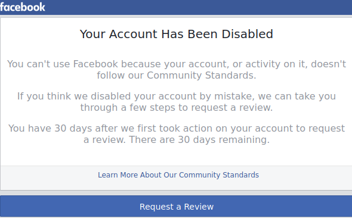

<div align="center" width="100%">
  
   <h1 align="center">Gorip v1.0</h1>
</div>
<p align="center">
	<a></a>
	<a></a>
</p>

#### It is a tool for login with multi-accounts into Facebook and commit basic interactions:
 - Make multi-reactions given a postURLs and a reactionIDs.
 - Get basic information from the user logged.
 - Multi-Scrap given facebookURLs.
 #### Without the need of Web Browser !!!

## Example Usage
### Import Gorip
```go
import "github.com/menesesghz/gorip/fbrip"
```
### Login into Facebook
```go
//Create usersRip
users := []*fbrip.UserRip{
    fbrip.CreateUser("mockuser@domainname.top","super_secret_pass"),
    fbrip.CreateUser("mockuser2@domainname.top","super_secret_pass"),
}

// Main loop
for i,user := range users{
  //Making GET Request to facebook.com, and saving Cookies need it for login.
  user.Sense()
  
  //Login into Fb. Gathering extra body parameters and cookies need it for be logged in.
  user.Rip()
  
  /*... Actions ...*/
}
```
### Get Basic Info
```go
//Action configuration for getting basic info
actionConfig := fbrip.ActionConfig{GetBasicInfo:true}

// Main loop
for i,user := range users{
    /*...*/
    user.Do(actionConfig)
    fmt.Printf("\n> User: %s | Gender:[ %s ] Birthday:[ %s ]\n",user.Info.Name,user.Info.Gender,user.Info.Birthday)
 }

```
### Make multiple Reactions in multiple accounts
The reactions Id are the same that Facebook provides and are listed below:

<br>
<div align="center" width="100%">
  
</div>
<br>

- "1" -> Like
- "2" -> Love
- "3" -> Care
- "4" -> Haha
- "5" -> Wow
- "6" -> Sad 
- "7" -> Angry

```go
//Create usersRip
users := []*fbrip.UserRip{
    fbrip.CreateUser("mockuser@domainname.top","super_secret_pass"),
    fbrip.CreateUser("mockuser2@domainname.top","super_secret_pass"),
}

//Urls Slice & reactionIds Slice (urls -> reactionsIds)
urls = []string{
	"https://www.facebook.com/googlemexico/videos/756896714867588/",
	"https://www.facebook.com/GolangSociety/photos/p.1832113056840497/1832113056840497/"
}
reactionIds = []string{"1","7"}

// Making action config
actionConfig := fbrip.ActionConfig{React: fbrip.CreateReact(reactionsIds,urls),}

//Main Loop
for _,user := range users{
	//Login	
	user.Sense()
	isLogged := user.Rip()
	if isLogged {
		//Do	
		user.Do(actionConfig)
	}
}
```
### Scrap Facebook Url
```go
//creating userRip and Login
user := fbrip.CreateUser("mockuser@domainname.top","super_secret_pass"),
user.Sense()
isLogged := user.Rip()

if isLogged {
  //Defining urls to scraps.
  urlSlice := []string{
    "https://www.facebook.com/GolangSociety",
    "https://www.facebook.com/googlemexico/"
  }

  //Define path where the HTMLs are going to be saved.
  path := "./scraps"

  //Action configuration for scrap
  scrap := fbrip.CreateScrap(path, urlSlice)
  actionConfig := fbrip.ActionConfig{Scrap:scrap}

  //User Do action
  user.Do(actionConfig)
}
```
### Doing the same thing as before, but with rip.json
```go
// Reading users and action config from JSON
users,actionConfig := fbrip.ReadRip("./rip.json")

// Main Loop 
for _,user := range users{
  // Login sequence
  user.Sense()
  isLogged := user.Rip()
  if isLogged {    
    u.Do(actionConfig)
    
    fmt.Printf("\n> User: %s | Gender:[ %s ] Birthday:[ %s ]\n",u.Info.Name,u.Info.Gender,u.Info.Birthday)
    fmt.Printf("* Actions Completed for -> %s\n\n",u.Parameters["email"])
   }
}
```
#### rip.json template
<a href="https://github.com/MenesesGHZ/gorip/blob/main/README.md">rip.json</a>

## Future work to implement
### Actions:
- Make post(s) in own Profile Page or given Url(s) 
- Send Random Friend Requests
- Make Comment(s) for a given postUrl
- Have more ideas...
### Features:
- Create Facebook user without the need of web browser. (maybe)
### New packages:
- instarip (Instagram)
- twtrip (Twitter)
- gmailrip (Gmail)

## About The Project
This project is the evidence for my first serius try to Go language. I wanted to make something with the language that challenges me. As you can see the code it is not perfect, and it can be optimized a lot. If you are interest in improving the project, to add it new cool functions or whatever. I invite you to send me a message and see what we can do. I am widely open to add colaborators to make this project better, and also for any suggestions or proposals.

## About Me
A Computer Science Student at CETYS.
If you want to contact me here is my email: <a href="mail:gerardo.meneses.hz@gmail.com">gerardo.meneses.hz@gmail.com </a>


## Thanks to
- My secondary account that has been banned for multiple testing requests. Rest in peace.

<div align="center" width="100%">
  
</div>
